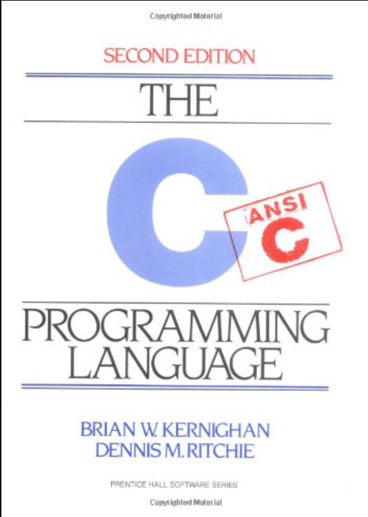

# DICTIONARY
## ABOUT

Simple library which provides few function to create simple dictionaries (in this libray refferd as **word**). You can test your self with some words, and the library will provide you with some results. All library is written in C99  and uses heavy struct based structure.

### Some funtionalities

- Creates dictionary and visualize it
- can test you from lectures and provide you results
- will test you from the whole dictionary(= word)
- allows you to add new lessons
- check for duplicates

## How to run this code
The program uses CMake as its build tool, but you can use a much simpler and more pleasing way, and that is to use Visual Studio or CLion directly with their imbedded CMake support. Simply open the folder through VS or CL and configure cache, and then you can build and run.

## Info about this project
 
     

This is a school task, which may accure on the final maturita exam, and it shall be well known, was given to my class from Mrs. Ing. Bozena Ralbova, who's my teacher for programming, and set deadline of January 31, 2023.

 

## Task given:
Create a program to work with a dictionary that represents a text file. On each line there is an Cyech word, an English word and a lesson number, all separated by a suitable separator. A word can be a general phrase(withspaces). In Czech words, for simplicity, we do not use hooks,...
	
> NOTE:  Create a user-friendly menu

1. TRANSLATION AJ CZ, CZ AJ
    - It can translate a given word
    - Separate function
    - Treat error conditions
    - Solve upper / lower case problem
2. VOCABULARY TEST FROM ONE LESSON
    - Lists all the Czech words from the lesson in turn and  foreach one expects its
	translation, immediately lists correct / wrong
	- Separate function
	- Treat error conditions
	- Solve upper / lower case problem
	- List testing statistics
	- Time limit for testing can be added
3. RANDOM TESTING FROM THE WHOLE DICTIONARY
	- The user specifies how many words he wants to select
	- The program randomly generates a specified number of words and allows testing
	- The words are not repeated
	- Recommendations (good to do at the beginning of random   testing) Create a custom function to determine the number of words in the dictionary, Generate 1 random number(= word order in the dictionary) and do testing for 1 random word
	- Separate function
	- Treat error conditions
	- Solve upper / lower case problem
	- List testing statistics
4. ADDS A WORD TO THE FILE
	- Adds the Czech word, English word and lesson number in the desired format to the end of the file
	- We only add a word if it is not in the dictionary
	- Separate function
	- Treat error conditions
	- Solve upper / lower case problem
5. EDIT EXPRESSION IN THE DICTIONARY(premium task)
	- Separate function
	- The function corrects a dictionary error(overwrites the wrong expression)
	- Another option - removes the entire line containing the specified word from the
	  dictionary
	

## How to read this file

To navigate in the .h document, you have to know some basic convetions

### Naming convetions

|convention|where is|example|
|---------|--------|-------|
|dicXxxxx|function name|dicCreateD(...)|
|DicXxxxx|struct/enum/union name|DicLanguage|
|DIC_XXXX|enum/macro value|DIC_FETCH_CONSOLE|

### File convetions
> Same as CSV(MS_DOS)

|line|content|example|
|-|-|-|
|1|lesson;[*from*];[*to*]|lesson;cs;en|
|2|[*lesson*];[*from*];[*to*]|2;ahoj;hello|
|N|[*lesson*];[*from*];[*to*]|N;xxxx;xxxxx|

> For **[from]** and **[to]** use valid *ISO-639-1* language code 
      (list of valid codes: https://en.wikipedia.org/wiki/List_of_ISO_639-1_codes).

 
## Meaning of some words
|word|meaning|
|-|-|
|dic|dictionary|
|word|an actual dictionary (CSV file)|
|fetch|fetch data from (console, file)|
|word entry|one line in word (one line in the csv file)|
|from|language from which we translate|
|to|language into which we translate|
|lesson|lesson in which we should learn the word (it's really weird, but the task has been given, so...)|
		
	

